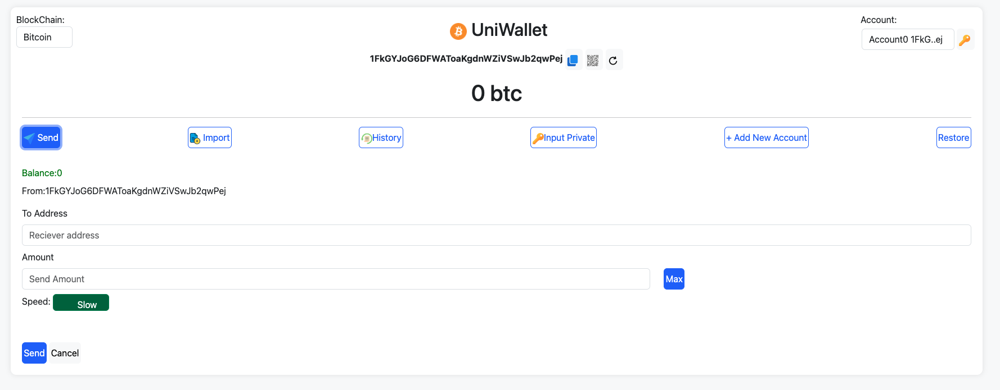

# UniWallet
 A non-custodial multi-wallet designed to support Bitcoin, Ethereum, Binance Smart Chain, Avalanche, Cronos and various other blockchains. It offers non-custodial storage for cryptocurrencies,Send Base Coin and Tokens.

 Current support Blockchain networks: 
Bitcoin,Dogecoin,Litecoin,Ethereum,Binance,Huobi,Fantom,Polygon,Avalanche,Cronos,Moonbeam,Moonriver.  
 
 
 
 

 

### How to run
Download,unzip,run index.html
