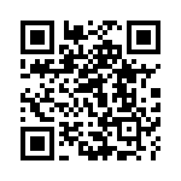

# UniWallet
 A non-custodial multi-wallet designed to support Bitcoin,Dogecoin,Ethereum,Litecoin, Binance Smart Chain, Avalanche, Cronos and various other blockchains. It offers non-custodial storage for cryptocurrencies,Send Base Coin and Tokens.

Support Blockchains: 
Bitcoin,Dogecoin,Litecoin,Ethereum,Solana,Tron,Binance,Huobi,Fantom,Polygon,Avalanche,Cronos,Moonbeam,Moonriver.  
 
 
 
 
 
 

 

### Web version:
https://cryptodapprun.github.io/UniWallet/

### For Mobile:

Features:
- Non-custodial-You hold your own private key.
- Send Bitcoin and Bitcoin-like coin.
- Send EVM base coin and tokens
- Import Private key
- Import Private key without save to device
- All private keys are encrypted and stored on your device.
- 24-word Mnemonic
- 0.5% fee

### Run on local computer
Download project,run index.html
